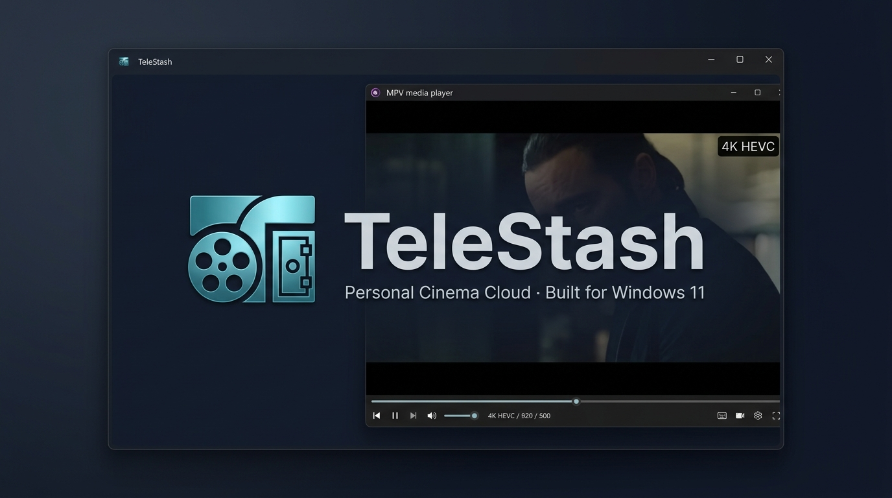
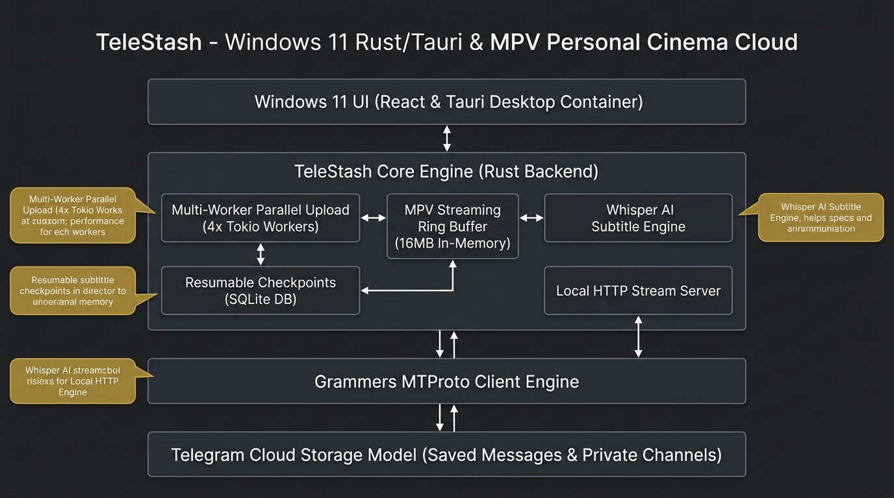
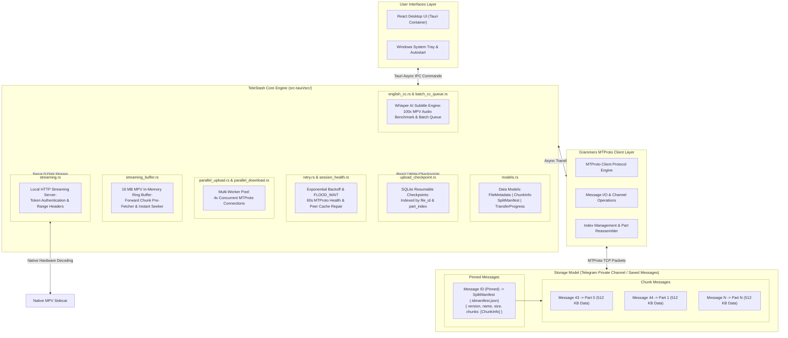
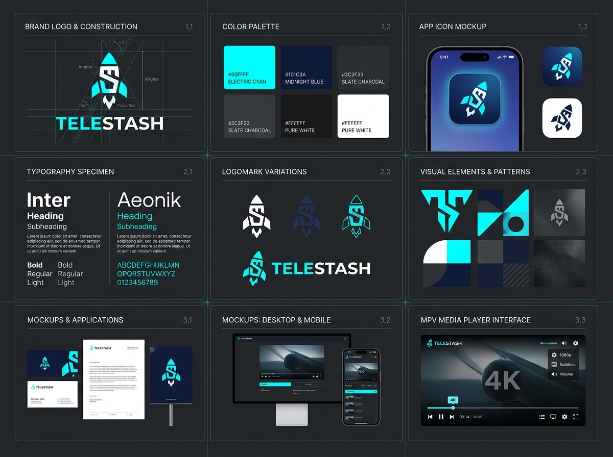

<div align="center">



# TeleStash

### *Windows 11 Personal Cinema Cloud & High-Speed Media Vault*

[](https://github.com/rasyidmmz/Telestash/releases/latest)
[](https://github.com/rasyidmmz/Telestash/releases/latest)
[](https://mpv.io)
[](https://mpv.io)
[](LICENSE)

<br/>

**TeleStash** is a native, high-performance Windows 11 desktop application that transforms Telegram's unlimited cloud storage into your private, buffer-free **Plex-style Personal Cinema Vault**.

Built with **Tauri v2, Rust, React, and native MPV sidecar**, TeleStash allows you to stream 4K/1080p **HEVC (x265), 10-bit HDR, MKV, and MP4** movies and TV series directly from the cloud with zero local disk footprint, automatic Whisper AI English subtitles, and multi-worker MTProto parallel transfer pools.

[**Download Latest Release (v1.9.34)**](https://github.com/rasyidmmz/Telestash/releases/latest) · [**Why TeleStash**](#-why-telestash) · [**System Architecture**](#-system-architecture) · [**Build Instructions**](#-build-from-source)

</div>

---

## ❓ What is TeleStash?

**TeleStash** is a dedicated Windows 11 personal media and file management suite that connects directly to Telegram's Data Centers via official MTProto protocols. It allows users to leverage Telegram's unlimited cloud storage as a private media server—similar to Plex or Infuse—without hosting hardware or paying for monthly cloud subscriptions.

Unlike generic file management scripts or web wrappers, TeleStash is built as a native 64-bit C++/Rust application integrated with a bundled **MPV media engine**. This enables native hardware decoding for heavy media formats—such as 4K HEVC/x265 10-bit HDR videos—with instant seek response and zero leftover temporary files on your hard drive.

---

## 💡 Why TeleStash?

| Feature / Metric | Standard Web Browsers & Cloud Apps | TeleStash Media Vault Engine |
| :--- | :--- | :--- |
| **Codec Support** | Limited (stutters or fails on HEVC/x265 & MKV) | **Native MPV Engine**: Smooth 4K HEVC, x265, 10-bit HDR, MKV, MP4 |
| **Disk Consumption** | Writes large cache files to `%TEMP%` / Disk | **Zero-Disk Footprint**: 16 MB in-memory ring buffer (0 Bytes left on disk) |
| **Subtitle Generation** | Manual download & sync required | **Automated Whisper AI**: 100x fast subtitle creation & auto-cloud upload |
| **Upload Transfer** | Single thread, starts from 0% if interrupted | **4-Worker MTProto Pool**: Parallel chunks + SQLite resumable checkpoints |
| **Security & Ads** | Third-party proxy servers, ad banners | **Direct Telegram MTProto**: 0 ads, 0 intermediate servers, 100% private |

### 🛡️ 1. Absolute Privacy & Security
* **Direct MTProto Connection**: TeleStash connects directly from your Windows machine to Telegram's official Data Centers. There are zero intermediate relay servers, zero proxy hops, and zero telemetry tracking.
* **User-Owned Credentials**: Authenticate securely using your own Telegram API ID and API Hash ([my.telegram.org](https://my.telegram.org)).
* **Ads-Free Commitment**: 100% open-source software with no ad banners, tracking scripts, or paid paywalls.

### 🎬 2. Buffer-Free Personal Cinema Experience
* **Native MPV Sidecar Engine**: Completely circumvents web browser video limitations. Play high-bitrate 4K HEVC/x265, 10-bit HDR, and MKV files with multi-channel audio tracks smoothly.
* **16 MB In-Memory Ring Buffer**: Implements forward chunk pre-fetching in RAM. Video seeks jump instantly with zero stuttering.
* **Zero-Disk Footprint**: Streamed video content is buffered entirely in memory. Closing a movie leaves **0 Bytes of temporary video files** on your SSD/HDD.

### ⏳ 3. Resumable Upload Checkpoints & Split Engine
* **SQLite Resumable Uploads**: Tracks chunk indices in a local SQLite database (`upload_checkpoints`). Network interruptions resume upload from chunk $N$ rather than starting over at 0%.
* **Automatic Large-File Splitting**: Files exceeding Telegram's single-file limit are split into 512 MB part messages with a `.tdmanifest.json` manifest, presented seamlessly as a single movie in TeleStash.

### 🎙️ 4. Automated Whisper AI Subtitles
* **100x Accelerated Audio Extraction**: MPV `--benchmark` extracts audio from a 2-hour movie in under 3 seconds.
* **System-Friendly Priority**: Whisper transcription runs at Win32 `BELOW_NORMAL_PRIORITY_CLASS` with capped CPU threads (max 2) to maintain zero system lag.
* **Auto-Upload to Cloud**: Generated `.en.srt` subtitle files are automatically uploaded back to your Telegram folder for future viewing.

---

## 🏗️ System Architecture





---

## 🚀 Key Features

* 🎥 **Native MPV Cinema Engine**: Direct hardware decoding for HEVC/x265, 10-bit HDR, MKV, MP4, and surround audio.
* ⚡ **4-Worker Parallel MTProto Engine**: 3x–5x faster upload and download speeds via multi-connection chunk pooling.
* 💾 **SQLite Resumable Uploads**: Auto-checkpointing lets interrupted transfers resume without data loss.
* 🎙️ **Automated Whisper AI Subtitles**: 1-click & batch season subtitle transcription with auto-cloud backup.
* 🛡️ **Zero-Disk Streaming**: 16 MB ring buffer streams video 100% in-memory without polluting local storage.
* 📁 **Folder & Channel Storage**: Organize movies and TV series using Saved Messages and private channels as folders.
* 📊 **Terminal Console Diagnostics**: Microsecond-precision event logging stream for real-time transfer monitoring.
* 🖥️ **Windows 11 System Integration**: Autostart toggle via `HKCU\Software\Microsoft\Windows\CurrentVersion\Run`.

---

## 🎨 Brand Identity & Visual System



### Core Metaphor: The Vault & The Stream
TeleStash combines **The Stash** (*an unlimited, private digital vault*) with **The Stream** (*instant, cinema-quality video playback*).

* **Electric Cyan (`#06B6D4`)**: High-speed data transmission & MTProto multi-worker streams.
* **Midnight Blue (`#0F172A`)**: Dark-mode personal cinema viewing environment.
* **Slate Charcoal (`#1E293B`)**: Minimalist, distraction-free desktop container UI.

---

## 💻 System Requirements

| Specification | Minimum Requirement |
| :--- | :--- |
| **Operating System** | Windows 11 (64-bit) |
| **Processor** | 64-bit Dual-Core CPU |
| **Memory** | 4 GB RAM |
| **Graphics** | DirectX 11 compatible GPU |
| **Network** | Broadband Internet Connection |

---

## ⬇️ Installation

Download the official setup installer from the [Releases](https://github.com/rasyidmmz/Telestash/releases/latest) page:

```text
TeleStash_1.9.34_x64-setup.exe
```

1. Run `TeleStash_1.9.34_x64-setup.exe` and follow the prompt.
2. Sign in with your Telegram API Credentials (API ID & API Hash from [my.telegram.org](https://my.telegram.org)).
3. Enjoy your personal, unlimited cinema cloud!

---

## 🛠️ Build From Source

### Prerequisites
- Node.js (v18+)
- Rust (Stable Toolchain)
- Visual Studio Build Tools with **Desktop development with C++**
- WebView2 Runtime

### Setup & Run
```powershell
# Clone the repository
git clone https://github.com/rasyidmmz/Telestash.git
cd Telestash\app

# Install dependencies & run in dev mode
npm install
npm run tauri dev
```

### Build Production NSIS Installer
```powershell
npm run tauri build
```

---

## 📄 License & Disclaimer

TeleStash is licensed under the **MIT License**.

> **Disclaimer**: TeleStash is an independent open-source project and is not affiliated with, endorsed by, or sponsored by Telegram FZ-LLC or Plex Inc. Please use TeleStash responsibly and in full compliance with Telegram's Terms of Service.
