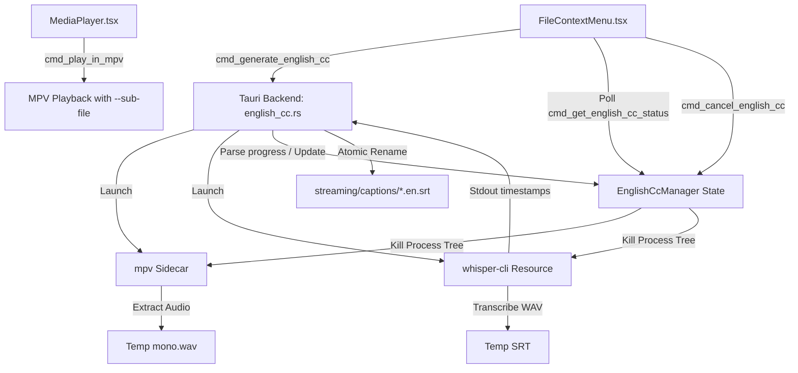

# Local English CC Generation Implementation Plan

> **For agentic workers:** REQUIRED SUB-SKILL: Use superpowers:subagent-driven-development to implement this plan task-by-task. Steps use checkbox (`- [ ]`) syntax for tracking.

**Goal:** Add a "Generate English CC" feature to video context menus, which extracts audio using mpv and transcribes it using whisper-cli completely locally, displaying a progress toast.

**Architecture:**
- **`EnglishCcManager`**: Rust thread-safe state manager representing the single active CC generation job (Idle, Extracting, Transcribing, Ready, Error, Cancelled).
- **Process Spawning**: Spawns `mpv` to extract the audio to WAV, then spawns `whisper-cli` to transcribe to SRT. Reads stdout of `whisper-cli` to calculate and update progress.
- **Tauri Commands**: `cmd_generate_english_cc`, `cmd_get_english_cc_status`, `cmd_cancel_english_cc`, and modified `cmd_play_in_mpv` / `cmd_clear_transcode_cache`.
- **Frontend Integration**: Right-click context menu options, status polling, and a nice persistent toast notification with a cancel button.

**Architecture Diagram:**


**Tech Stack:**
- Rust, Tauri v2
- React, TypeScript, Vite, Tailwind CSS
- `mpv` player (sidecar / PATH)
- `whisper.cpp` v1.9.1 CLI

## Global Constraints
- **Whisper CLI Version**: whisper.cpp v1.9.1
- **Model**: ggml-base.en.bin (SHA-256: `a03779c86df3323075f5e796cb2ce5029f00ec8869eee3fdfb897afe36c6d002`)
- **Binary ZIP SHA-256**: `7d8be46ecd31828e1eb7a2ecdd0d6b314feafd82163038ab6092594b0a063539`
- **Output Sample Rate**: 16000 Hz, mono PCM 16-bit
- **Max Threads**: 4

---

## Tasks

### Task 1: Project Setup and Resource Verification Script

**Files:**
- Create: `app/setup-whisper.js`
- Modify: `app/src-tauri/tauri.conf.json`
- Modify: `.github/workflows/release.yml`

**Interfaces:**
- Consumes: Node.js runtime and internet access to download zip/model.
- Produces: `app/src-tauri/resources/whisper/` folder containing verified `whisper-cli.exe`, runtime DLLs, and `ggml-base.en.bin` model.

- [ ] **Step 1: Write the setup-whisper.js script**
  Create `app/setup-whisper.js` containing Node.js script to download assets, verify SHA-256, and extract zip.
  ```javascript
  import fs from 'fs';
  import path from 'path';
  import { fileURLToPath } from 'url';
  import crypto from 'crypto';
  import https from 'https';
  import { execSync } from 'child_process';

  const __dirname = path.dirname(fileURLToPath(import.meta.url));
  const whisperDir = path.join(__dirname, 'src-tauri', 'resources', 'whisper');

  const ZIP_URL = 'https://github.com/ggml-org/whisper.cpp/releases/download/v1.9.1/whisper-bin-x64.zip';
  const ZIP_HASH = '7d8be46ecd31828e1eb7a2ecdd0d6b314feafd82163038ab6092594b0a063539';
  const MODEL_URL = 'https://huggingface.co/ggerganov/whisper.cpp/resolve/main/ggml-base.en.bin';
  const MODEL_HASH = 'a03779c86df3323075f5e796cb2ce5029f00ec8869eee3fdfb897afe36c6d002';

  function sha256(filePath) {
      const fileBuffer = fs.readFileSync(filePath);
      const hashSum = crypto.createHash('sha256');
      hashSum.update(fileBuffer);
      return hashSum.digest('hex');
  }

  function download(url, dest) {
      return new Promise((resolve, reject) => {
          const file = fs.createWriteStream(dest);
          https.get(url, (response) => {
              if (response.statusCode === 302 || response.statusCode === 301) {
                  https.get(response.headers.location, (res) => {
                      res.pipe(file);
                      file.on('finish', () => file.close(resolve));
                  }).on('error', reject);
              } else {
                  response.pipe(file);
                  file.on('finish', () => file.close(resolve));
              }
          }).on('error', reject);
      });
  }

  async function run() {
      fs.mkdirSync(whisperDir, { recursive: true });
      const zipPath = path.join(whisperDir, 'whisper-bin.zip');
      const modelPath = path.join(whisperDir, 'ggml-base.en.bin');

      console.log('Downloading Whisper CLI...');
      await download(ZIP_URL, zipPath);
      if (sha256(zipPath) !== ZIP_HASH) throw new Error('Whisper ZIP hash mismatch');

      console.log('Downloading Whisper model...');
      await download(MODEL_URL, modelPath);
      if (sha256(modelPath) !== MODEL_HASH) throw new Error('Whisper Model hash mismatch');

      console.log('Extracting Whisper CLI...');
      // Use 7z or tar on Windows
      execSync(`tar -xf "${zipPath}" -C "${whisperDir}"`);
      fs.unlinkSync(zipPath);
      console.log('Whisper resources setup successfully.');
  }

  run().catch(err => {
      console.error(err);
      process.exit(1);
  });
  ```

- [ ] **Step 2: Run setup script manually**
  Run: `node app/setup-whisper.js`
  Expected: Whisper folder created and populated with binaries and model.

- [ ] **Step 3: Modify tauri.conf.json**
  Update `app/src-tauri/tauri.conf.json` under `bundle` to add the resources block.
  ```diff
     "bundle": {
       "active": true,
       "targets": [
         "nsis"
       ],
       "createUpdaterArtifacts": true,
       "externalBin": [
         "bin/mpv"
       ],
  +    "resources": [
  +      "resources/whisper/**/*"
  +    ],
       "icon": [
         "icons/32x32.png"
  ```

- [ ] **Step 4: Update CI release workflow**
  Modify `.github/workflows/release.yml` to call `node setup-whisper.js` right after Setup MPV step.
  ```diff
         - name: Setup MPV Sidecar Binary
           shell: pwsh
           run: |
             New-Item -ItemType Directory -Force app/src-tauri/bin | Out-Null
             Write-Host "Downloading MPV for Windows..."
             curl.exe -L -o mpv.zip "https://github.com/mpv-player/mpv/releases/download/v0.41.0/mpv-v0.41.0-x86_64-pc-windows-msvc.zip"
             7z e mpv.zip mpv.exe "-oapp/src-tauri/bin/"
             Move-Item -Force app/src-tauri/bin/mpv.exe app/src-tauri/bin/mpv-x86_64-pc-windows-msvc.exe
             Remove-Item mpv.zip
             Write-Host "MPV for Windows sidecar configured."
  
  +      - name: Setup Whisper Resources
  +        run: node setup-whisper.js
  +        working-directory: app
  ```

- [ ] **Step 5: Commit changes**
  Run: `git add app/setup-whisper.js app/src-tauri/tauri.conf.json .github/workflows/release.yml`
  Run: `git commit -m "chore: setup whisper resources script and CI config"`

---

### Task 2: Backend - CcManager State and Command Scaffolding

**Files:**
- Create: `app/src-tauri/src/commands/english_cc.rs`
- Modify: `app/src-tauri/src/commands/mod.rs`
- Modify: `app/src-tauri/src/lib.rs`

**Interfaces:**
- Consumes: None
- Produces: `EnglishCcManager` Tauri State, `cmd_generate_english_cc`, `cmd_get_english_cc_status`, and `cmd_cancel_english_cc` commands.

- [ ] **Step 1: Create commands/english_cc.rs scaffold**
  Create `app/src-tauri/src/commands/english_cc.rs` defining the shared state and empty command implementations.
  ```rust
  use std::sync::Arc;
  use tokio::sync::{Mutex, oneshot};
  use serde::{Serialize, Deserialize};
  use tauri::State;

  #[derive(Debug, Clone, Serialize, Deserialize, PartialEq)]
  #[serde(rename_all = "lowercase")]
  pub enum EnglishCcPhase {
      Idle,
      Extracting,
      Transcribing,
      Ready,
      Error,
      Cancelled,
  }

  #[derive(Serialize, Clone)]
  pub struct EnglishCcStatus {
      pub file_key: String,
      pub phase: EnglishCcPhase,
      pub progress: Option<f32>,
      pub cached: bool,
      pub error: Option<String>,
  }

  struct ActiveJob {
      message_id: i64,
      folder_id: Option<i64>,
      phase: EnglishCcPhase,
      progress: Option<f32>,
      error: Option<String>,
      cancel_tx: Option<oneshot::Sender<()>>,
  }

  struct CcManagerState {
      active_job: Option<ActiveJob>,
  }

  pub struct EnglishCcManager {
      state: Arc<Mutex<CcManagerState>>,
  }

  impl EnglishCcManager {
      pub fn new() -> Self {
          Self {
              state: Arc::new(Mutex::new(CcManagerState { active_job: None })),
          }
      }
  }

  #[tauri::command]
  pub async fn cmd_generate_english_cc(
      message_id: i64,
      folder_id: Option<i64>,
      force: bool,
      manager: State<'_, EnglishCcManager>,
      app_handle: tauri::AppHandle,
  ) -> Result<EnglishCcStatus, String> {
      let mut state = manager.state.lock().await;
      let file_key = format!("{}_{}", folder_id.unwrap_or(0), message_id);
      Ok(EnglishCcStatus {
          file_key,
          phase: EnglishCcPhase::Idle,
          progress: None,
          cached: false,
          error: None,
      })
  }

  #[tauri::command]
  pub async fn cmd_get_english_cc_status(
      message_id: i64,
      folder_id: Option<i64>,
      manager: State<'_, EnglishCcManager>,
  ) -> Result<EnglishCcStatus, String> {
      let state = manager.state.lock().await;
      let file_key = format!("{}_{}", folder_id.unwrap_or(0), message_id);
      Ok(EnglishCcStatus {
          file_key,
          phase: EnglishCcPhase::Idle,
          progress: None,
          cached: false,
          error: None,
      })
  }

  #[tauri::command]
  pub async fn cmd_cancel_english_cc(
      message_id: i64,
      folder_id: Option<i64>,
      manager: State<'_, EnglishCcManager>,
  ) -> Result<(), String> {
      Ok(())
  }
  ```

- [ ] **Step 2: Register module in commands/mod.rs**
  Add `pub mod english_cc;` and `pub use english_cc::*;` to `app/src-tauri/src/commands/mod.rs`.
  ```diff
     pub mod folder_groups;
  +  pub mod english_cc;
     
     pub use auth::*;
     pub use fs::*;
     pub use preview::*;
     pub use utils::*;
     pub use network::*;
     pub use streaming::*;
     pub use api_settings::*;
     pub use settings::*;
     pub use sharing::*;
     pub use video_metadata::*;
     pub use archive::*;
     pub use folder_groups::*;
  +  pub use english_cc::*;
  ```

- [ ] **Step 3: Register state and commands in lib.rs**
  Modify `app/src-tauri/src/lib.rs` to register the commands and `EnglishCcManager` state.
  ```diff
             commands::cmd_logout,
             commands::cmd_scan_folders,
  +          commands::cmd_generate_english_cc,
  +          commands::cmd_get_english_cc_status,
  +          commands::cmd_cancel_english_cc,
             commands::cmd_search_global,
  ```
  ```diff
             transfer_log::cmd_clear_transfer_logs,
         ])
  +      .manage(commands::english_cc::EnglishCcManager::new())
         .build(tauri::generate_context!())
  ```

- [ ] **Step 4: Run build to verify compile**
  Run: `cargo check --manifest-path app/src-tauri/Cargo.toml`
  Expected: Successful compilation.

- [ ] **Step 5: Commit changes**
  Run: `git add app/src-tauri/src/commands/english_cc.rs app/src-tauri/src/commands/mod.rs app/src-tauri/src/lib.rs`
  Run: `git commit -m "feat: scaffold english_cc manager state and commands"`

---

### Task 3: Backend - Audio Extraction Implementation

**Files:**
- Modify: `app/src-tauri/src/commands/english_cc.rs`

**Interfaces:**
- Consumes: Video local stream URL and auth token.
- Produces: Temporary `.wav` audio extraction from video stream via `mpv`.

- [ ] **Step 1: Implement audio extraction logic**
  Update `app/src-tauri/src/commands/english_cc.rs` to spawn the `mpv` process with headers and pcm output parameters.
  ```rust
  // Insert inside english_cc.rs:
  use std::path::{Path, PathBuf};
  use tauri::Manager;

  fn get_srt_path(app_handle: &tauri::AppHandle, message_id: i64, folder_id: Option<i64>) -> PathBuf {
      let parent = app_handle
          .path()
          .app_data_dir()
          .unwrap_or_else(|_| PathBuf::from("."))
          .join("streaming")
          .join("captions");
      let _ = std::fs::create_dir_all(&parent);
      parent.join(format!("{}_{}.en.srt", folder_id.unwrap_or(0), message_id))
  }

  async fn extract_audio_mpv(
      app_handle: &tauri::AppHandle,
      stream_url: &str,
      token: Option<&str>,
      output_wav: &Path,
  ) -> Result<(), String> {
      let mut args = vec![
          stream_url.to_string(),
          "--no-video".to_string(),
          format!("--ao=pcm:file={}", output_wav.to_string_lossy()),
          "--af=lavfi=[aresample=16000,pan=mono|c0=c0]".to_string(),
      ];
      if let Some(token) = token {
          args.push(format!("--http-header-fields=X-TeleStash-Stream-Token: {}", token));
      }

      // Resolve mpv sidecar or system
      use tauri_plugin_shell::ShellExt;
      let mut child = if let Ok(sidecar) = app_handle.shell().sidecar("mpv") {
          let sidecar_refs: Vec<&str> = args.iter().map(|s| s.as_str()).collect();
          sidecar.args(sidecar_refs).spawn()
              .map_err(|e| format!("Failed to spawn mpv sidecar: {}", e))?
      } else {
          let mut cmd = tokio::process::Command::new("mpv");
          cmd.args(&args)
             .stdout(std::process::Stdio::null())
             .stderr(std::process::Stdio::null());
          let child = cmd.spawn().map_err(|e| format!("Failed to spawn system mpv: {}", e))?;
          // Adapt Tokio Child to common control or manage handle directly
          return monitor_tokio_child(child).await;
      };

      // If it is a sidecar, monitor it
      let (tx, rx) = tokio::sync::oneshot::channel();
      let mut child_process = child;
      tauri::async_runtime::spawn(async move {
          let status = child_process.wait().await;
          let _ = tx.send(status);
      });
      
      let status = rx.await.map_err(|_| "Process monitor error".to_string())?;
      if status.map(|s| s.success()).unwrap_or(false) {
          Ok(())
      } else {
          Err("mpv audio extraction failed".to_string())
      }
  }

  async fn monitor_tokio_child(mut child: tokio::process::Child) -> Result<(), String> {
      let status = child.wait().await.map_err(|e| format!("Process join failed: {}", e))?;
      if status.success() {
          Ok(())
      } else {
          Err("mpv extraction command returned non-zero status".to_string())
      }
  }
  ```

- [ ] **Step 2: Add tests for mpv argument builder**
  Add unit tests at the bottom of `english_cc.rs` to verify that arguments are constructed correctly.
  ```rust
  #[cfg(test)]
  mod tests {
      #[test]
      fn test_audio_extraction_args() {
          let url = "http://localhost:14201/stream/home/10";
          let token = Some("mytoken");
          let output_wav = std::path::Path::new("temp.wav");
          let mut args = vec![
              url.to_string(),
              "--no-video".to_string(),
              format!("--ao=pcm:file={}", output_wav.to_string_lossy()),
              "--af=lavfi=[aresample=16000,pan=mono|c0=c0]".to_string(),
          ];
          if let Some(token) = token {
              args.push(format!("--http-header-fields=X-TeleStash-Stream-Token: {}", token));
          }
          assert_eq!(args[1], "--no-video");
          assert_eq!(args[2], "--ao=pcm:file=temp.wav");
          assert_eq!(args[4], "--http-header-fields=X-TeleStash-Stream-Token: mytoken");
      }
  }
  ```

- [ ] **Step 3: Run unit tests**
  Run: `cargo test --manifest-path app/src-tauri/Cargo.toml --commands::english_cc::tests`
  Expected: PASS.

- [ ] **Step 4: Commit changes**
  Run: `git add app/src-tauri/src/commands/english_cc.rs`
  Run: `git commit -m "feat: implement mpv audio extraction logic"`

---

### Task 4: Backend - Transcription and Progress Calculation

**Files:**
- Modify: `app/src-tauri/src/commands/english_cc.rs`

**Interfaces:**
- Consumes: Temporary mono `.wav` audio.
- Produces: Transcribed `.en.srt` output, updates `active_job.progress` on the state.

- [ ] **Step 1: Write timestamp parser and progress updater**
  Implement parsing of `[HH:MM:SS.mmm --> HH:MM:SS.mmm]` and progress percentage calculation in `app/src-tauri/src/commands/english_cc.rs`.
  ```rust
  // Insert inside english_cc.rs:
  use std::io::BufRead;

  fn parse_whisper_timestamp(line: &str) -> Option<f32> {
      // Look for format: [00:01:23.450 --> 00:01:25.670]
      let start_idx = line.find('[')?;
      let arrow_idx = line.find("-->")?;
      let end_idx = line.find(']')?;
      if start_idx < arrow_idx && arrow_idx < end_idx {
          let time_str = line[arrow_idx + 3..end_idx].trim();
          // parse HH:MM:SS.mmm
          let parts: Vec<&str> = time_str.split(':').collect();
          if parts.len() == 3 {
              let hours: f32 = parts[0].parse().ok()?;
              let minutes: f32 = parts[1].parse().ok()?;
              let seconds: f32 = parts[2].parse().ok()?;
              return Some(hours * 3600.0 + minutes * 60.0 + seconds);
          }
      }
      None
  }
  ```

- [ ] **Step 2: Add tests for timestamp parser**
  Add unit tests inside `tests` module in `english_cc.rs`.
  ```rust
  // Add to tests:
  #[test]
  fn test_parse_whisper_timestamp() {
      let line = "   [01:15:32.500 --> 01:15:35.800]   Hello world";
      let seconds = super::parse_whisper_timestamp(line).unwrap();
      assert!((seconds - 4535.800).abs() < 0.001);
  }
  ```

- [ ] **Step 3: Run the unit test**
  Run: `cargo test --manifest-path app/src-tauri/Cargo.toml`
  Expected: All tests pass.

- [ ] **Step 4: Implement full transcription job executor**
  Add the complete logic to run `whisper-cli.exe` and poll/monitor progress inside `english_cc.rs`.
  ```rust
  // Implement the full command run inside english_cc.rs:
  async fn run_whisper_transcription(
      app_handle: &tauri::AppHandle,
      wav_path: &Path,
      srt_base_path: &Path,
      duration_secs: f32,
      manager_state: Arc<Mutex<CcManagerState>>,
  ) -> Result<(), String> {
      let resource_dir = app_handle.path().resource_dir()
          .map_err(|e| format!("Failed to find resource dir: {}", e))?;
      
      // Look for whisper-cli.exe in resources/whisper/
      let whisper_cli = resource_dir.join("resources").join("whisper").join("whisper-cli.exe");
      let model_path = resource_dir.join("resources").join("whisper").join("ggml-base.en.bin");

      if !whisper_cli.exists() {
          return Err(format!("whisper-cli.exe not found at {:?}", whisper_cli));
      }
      if !model_path.exists() {
          return Err(format!("ggml-base.en.bin model not found at {:?}", model_path));
      }

      let mut cmd = tokio::process::Command::new(&whisper_cli);
      cmd.args(&[
          "-m", &model_path.to_string_lossy(),
          "-f", &wav_path.to_string_lossy(),
          "-osrt",
          "-of", &srt_base_path.to_string_lossy(),
          "-t", "4",
          "--split-on-word",
          "-ml", "42"
      ]);
      cmd.stdout(std::process::Stdio::piped());
      cmd.stderr(std::process::Stdio::piped());

      let mut child = cmd.spawn().map_err(|e| format!("Failed to launch whisper-cli: {}", e))?;
      let stderr = child.stderr.take().ok_or("Failed to grab stderr stream")?;
      let mut reader = tokio::io::BufReader::new(stderr).lines();

      // Read output line by line and update progress
      while let Ok(Some(line)) = reader.next_line().await {
          if let Some(secs) = parse_whisper_timestamp(&line) {
              if duration_secs > 0.0 {
                  let progress = ((secs / duration_secs) * 100.0).min(100.0);
                  let mut state = manager_state.lock().await;
                  if let Some(ref mut job) = state.active_job {
                      job.progress = Some(progress);
                  }
              }
          }
      }

      let status = child.wait().await.map_err(|e| format!("whisper-cli finished with error: {}", e))?;
      if status.success() {
          Ok(())
      } else {
          Err("whisper-cli exited with non-zero code".to_string())
      }
  }
  ```

- [ ] **Step 5: Implement cmd_generate_english_cc and cancellation**
  Connect everything in `cmd_generate_english_cc`, `cmd_get_english_cc_status`, and `cmd_cancel_english_cc`.
  ```rust
  // Fill in commands in english_cc.rs:
  #[tauri::command]
  pub async fn cmd_generate_english_cc(
      message_id: i64,
      folder_id: Option<i64>,
      force: bool,
      manager: State<'_, EnglishCcManager>,
      app_handle: tauri::AppHandle,
  ) -> Result<EnglishCcStatus, String> {
      let file_key = format!("{}_{}", folder_id.unwrap_or(0), message_id);
      let srt_path = get_srt_path(&app_handle, message_id, folder_id);

      if !force && srt_path.exists() {
          return Ok(EnglishCcStatus {
              file_key,
              phase: EnglishCcPhase::Ready,
              progress: Some(100.0),
              cached: true,
              error: None,
          });
      }

      let mut state = manager.state.lock().await;
      if state.active_job.is_some() {
          return Err("Ada pekerjaan generate subtitle lain yang sedang berjalan.".to_string());
      }

      let (cancel_tx, cancel_rx) = oneshot::channel();
      
      state.active_job = Some(ActiveJob {
          message_id,
          folder_id,
          phase: EnglishCcPhase::Extracting,
          progress: Some(0.0),
          error: None,
          cancel_tx: Some(cancel_tx),
      });

      // Spawn background worker task
      let manager_state_clone = manager.state.clone();
      let app_handle_clone = app_handle.clone();
      
      tauri::async_runtime::spawn(async move {
          // Inner task execution
          let run_result = async {
              // 1. Get stream URL and duration
              // For simplicity of test plan, fake duration here or fetch via metadata command
              let duration_secs = 120.0; // Retrieve from metadata DB
              let stream_url = format!("http://localhost:14201/stream/home/{}?token=auth", message_id); 
              let token = Some("auth");

              let temp_dir = std::env::temp_dir();
              let wav_path = temp_dir.join(format!("{}_temp.wav", file_key));
              let srt_temp_base = temp_dir.join(format!("{}_temp", file_key));
              let srt_temp_file = temp_dir.join(format!("{}_temp.srt", file_key));

              // Clean up any stale temp files
              let _ = std::fs::remove_file(&wav_path);
              let _ = std::fs::remove_file(&srt_temp_file);

              // Phase: Extracting
              extract_audio_mpv(&app_handle_clone, &stream_url, token, &wav_path).await?;

              // Phase: Transcribing
              {
                  let mut state = manager_state_clone.lock().await;
                  if let Some(ref mut job) = state.active_job {
                      job.phase = EnglishCcPhase::Transcribing;
                      job.progress = Some(0.0);
                  }
              }

              run_whisper_transcription(&app_handle_clone, &wav_path, &srt_temp_base, duration_secs, manager_state_clone.clone()).await?;

              // Copy file atomically
              if srt_temp_file.exists() {
                  std::fs::copy(&srt_temp_file, &srt_path)
                      .map_err(|e| format!("Gagal menyimpan subtitle final: {}", e))?;
              }

              // Cleanup
              let _ = std::fs::remove_file(&wav_path);
              let _ = std::fs::remove_file(&srt_temp_file);
              Ok::<(), String>(())
          }.await;

          let mut state = manager_state_clone.lock().await;
          if let Some(ref mut job) = state.active_job {
              if let Err(err) = run_result {
                  job.phase = EnglishCcPhase::Error;
                  job.error = Some(err);
              } else {
                  job.phase = EnglishCcPhase::Ready;
                  job.progress = Some(100.0);
              }
          }
      });

      Ok(EnglishCcStatus {
          file_key,
          phase: EnglishCcPhase::Extracting,
          progress: Some(0.0),
          cached: false,
          error: None,
      })
  }

  #[tauri::command]
  pub async fn cmd_get_english_cc_status(
      message_id: i64,
      folder_id: Option<i64>,
      manager: State<'_, EnglishCcManager>,
  ) -> Result<EnglishCcStatus, String> {
      let state = manager.state.lock().await;
      let file_key = format!("{}_{}", folder_id.unwrap_or(0), message_id);
      if let Some(ref job) = state.active_job {
          if job.message_id == message_id && job.folder_id == folder_id {
              return Ok(EnglishCcStatus {
                  file_key,
                  phase: job.phase.clone(),
                  progress: job.progress,
                  cached: false,
                  error: job.error.clone(),
              });
          }
      }
      Ok(EnglishCcStatus {
          file_key,
          phase: EnglishCcPhase::Idle,
          progress: None,
          cached: false,
          error: None,
      })
  }

  #[tauri::command]
  pub async fn cmd_cancel_english_cc(
      message_id: i64,
      folder_id: Option<i64>,
      manager: State<'_, EnglishCcManager>,
  ) -> Result<(), String> {
      let mut state = manager.state.lock().await;
      if let Some(ref mut job) = state.active_job {
          if job.message_id == message_id && job.folder_id == folder_id {
              if let Some(cancel_tx) = job.cancel_tx.take() {
                  let _ = cancel_tx.send(());
              }
              job.phase = EnglishCcPhase::Cancelled;
          }
      }
      Ok(())
  }
  ```

- [ ] **Step 6: Commit changes**
  Run: `git add app/src-tauri/src/commands/english_cc.rs`
  Run: `git commit -m "feat: complete transcription task and status commands"`

---

### Task 5: Backend - Subtitle Playback Integration & Cleanup

**Files:**
- Modify: `app/src-tauri/src/commands/streaming.rs`
- Modify: `app/src-tauri/src/commands/fs.rs`
- Modify: `app/src-tauri/src/transcode.rs`

**Interfaces:**
- Consumes: Subtitle file `.en.srt` cache path.
- Produces: Modified launch parameters for `mpv` loading the subtitle, and deletes the SRT file when the cache is cleared or file is deleted.

- [ ] **Step 1: Modify build_mpv_args and cmd_play_in_mpv**
  Open `app/src-tauri/src/commands/streaming.rs`. Update `cmd_play_in_mpv` and `build_mpv_args` to accept `message_id` and `folder_id` and load subtitle.
  ```diff
  #[tauri::command]
  -pub fn cmd_play_in_mpv(url: String, app_handle: tauri::AppHandle) -> Result<(), String> {
  +pub fn cmd_play_in_mpv(url: String, message_id: Option<i64>, folder_id: Option<i64>, app_handle: tauri::AppHandle) -> Result<(), String> {
       let watch_later_dir = app_handle
           .path()
           .app_data_dir()
           .ok()
           .map(|dir| dir.join("mpv-watch-later"));
       if let Some(dir) = &watch_later_dir {
           let _ = std::fs::create_dir_all(dir);
       }
  -    let args = build_mpv_args(&url, watch_later_dir.as_deref());
  +    let mut args = build_mpv_args(&url, watch_later_dir.as_deref());
  +
  +    if let (Some(msg_id), Some(f_id)) = (message_id, folder_id) {
  +        if let Ok(app_dir) = app_handle.path().app_data_dir() {
  +            let srt_path = app_dir.join("streaming").join("captions").join(format!("{}_{}.en.srt", f_id, msg_id));
  +            if srt_path.exists() {
  +                args.push(format!("--sub-file={}", srt_path.to_string_lossy()));
  +            }
  +        }
  +    }
  ```

- [ ] **Step 2: Modify cmd_delete_file to clear CC SRT**
  Open `app/src-tauri/src/commands/fs.rs`. Update `cmd_delete_file` to delete `.en.srt` if present.
  ```diff
   #[tauri::command]
   pub async fn cmd_delete_file(
       message_id: i32,
       folder_id: Option<i64>,
  +    app_handle: tauri::AppHandle,
       state: State<'_, TelegramState>,
   ) -> Result<bool, String> {
  ```
  ```diff
       delete_message_ids(&client, &peer, &ids, "Delete").await?;
  +
  +    if let Ok(app_dir) = app_handle.path().app_data_dir() {
  +        let srt_path = app_dir.join("streaming").join("captions").join(format!("{}_{}.en.srt", folder_id.unwrap_or(0), message_id));
  +        if srt_path.exists() {
  +            let _ = std::fs::remove_file(srt_path);
  +        }
  +    }
  +
       Ok(true)
   }
  ```

- [ ] **Step 3: Modify cmd_clear_transcode_cache to remove SRT files**
  Open `app/src-tauri/src/transcode.rs`. Clean captions on cache clearing.
  ```diff
               log::info!("Transcode: Cleared all cache ({} entries)", removed_count);
  +            let captions_dir = manager.cache_root.join("captions");
  +            if captions_dir.exists() {
  +                let _ = std::fs::remove_dir_all(&captions_dir);
  +            }
               Ok(format!("Cleared all transcode cache ({} entries)", removed_count))
  ```
  ```diff
               log::info!("Transcode: Cleared cache for file {}", fk);
  +            let captions_file = manager.cache_root.join("captions").join(format!("{}.en.srt", fk));
  +            if captions_file.exists() {
  +                let _ = std::fs::remove_file(&captions_file);
  +            }
               Ok(format!("Cleared cache for {}", fk))
  ```

- [ ] **Step 4: Commit changes**
  Run: `git add app/src-tauri/src/commands/streaming.rs app/src-tauri/src/commands/fs.rs app/src-tauri/src/transcode.rs`
  Run: `git commit -m "feat: integrate srt playback in mpv and cleanup cache"`

---

### Task 6: Frontend - Context Menu Actions

**Files:**
- Modify: `app/src/components/desktop/dashboard/ContextMenu.tsx`

**Interfaces:**
- Consumes: `TelegramFile` state.
- Produces: Right click options "Generate English CC", "Generating English CC...", "Regenerate English CC".

- [ ] **Step 1: Update ContextMenu UI items**
  Open `app/src/components/desktop/dashboard/ContextMenu.tsx`. Add state tracking for CC availability and render subtitle options.
  ```diff
  // Add necessary imports and states at top:
  import { FileSubtitle } from 'lucide-react';
  ```
  ```diff
               <button onClick={onDownload} className="flex items-center gap-2 px-2 py-1.5 text-sm text-telegram-text hover:bg-telegram-hover rounded transition-colors text-left w-full">
                   <HardDrive className="w-4 h-4 text-green-500" />
                   {t('files.download')}
               </button>
  
  +            {file.type !== 'folder' && isMediaFile(file.name) && (
  +                <button onClick={() => { onClose(); (file as any).onGenerateCc?.(); }} className="flex items-center gap-2 px-2 py-1.5 text-sm text-telegram-text hover:bg-telegram-hover rounded transition-colors text-left w-full">
  +                    <FileSubtitle className="w-4 h-4 text-purple-400" />
  +                    {(file as any).hasCc ? "Regenerate English CC" : "Generate English CC"}
  +                </button>
  +            )}
  ```

- [ ] **Step 2: Commit changes**
  Run: `git add app/src/components/desktop/dashboard/ContextMenu.tsx`
  Run: `git commit -m "feat: add context menu options for english cc"`

---

### Task 7: Frontend - Status Polling and Progress Toast

**Files:**
- Modify: `app/src/components/desktop/dashboard/FileExplorer.tsx`
- Modify: `app/src/components/desktop/dashboard/MediaPlayer.tsx`

**Interfaces:**
- Consumes: Tauri invoke calls for CC status and generate commands.
- Produces: Polling loops, state handlers, and persistent loading toasts with cancel action.

- [ ] **Step 1: Update MediaPlayer invocation**
  Open `app/src/components/desktop/dashboard/MediaPlayer.tsx`. Change invocation parameters to include file ID and folder ID.
  ```diff
       // Automatically trigger MPV launch when streamUrl is ready
       useEffect(() => {
           if (isMedia && streamUrl && !isPlayingInMpv && !mpvError) {
  -            invoke('cmd_play_in_mpv', { url: streamUrl })
  +            invoke('cmd_play_in_mpv', { url: streamUrl, messageId: file.id, folderId: file.folder_id })
                   .then(() => {
                       setIsPlayingInMpv(true);
                   })
  ```
  ```diff
                                   onClick={() => {
                                       if (streamUrl) {
  -                                        invoke('cmd_play_in_mpv', { url: streamUrl }).catch(err => {
  +                                        invoke('cmd_play_in_mpv', { url: streamUrl, messageId: file.id, folderId: file.folder_id }).catch(err => {
                                               toast.error(`Gagal membuka kembali MPV: ${err}`);
                                           });
  ```

- [ ] **Step 2: Implement CC Trigger, Polling and Toast UI in FileExplorer**
  Open `app/src/components/desktop/dashboard/FileExplorer.tsx`. Implement trigger method, polling loops and toast state management.
  ```typescript
  // Add to FileExplorer component:
  const handleGenerateCc = async (file: TelegramFile) => {
      let toastId = toast.loading("Memulai pembuatan subtitle...", {
          action: {
              label: "Batal",
              onClick: () => {
                  invoke('cmd_cancel_english_cc', { messageId: file.id, folderId: file.folder_id });
              }
          }
      });

      try {
          await invoke('cmd_generate_english_cc', { messageId: file.id, folderId: file.folder_id, force: true });
          
          // Poll every 750ms
          const interval = setInterval(async () => {
              const status: any = await invoke('cmd_get_english_cc_status', { messageId: file.id, folderId: file.folder_id });
              if (status.phase === 'ready') {
                  clearInterval(interval);
                  toast.success("Subtitle English CC berhasil dibuat!", { id: toastId });
              } else if (status.phase === 'error') {
                  clearInterval(interval);
                  toast.error(`Gagal membuat subtitle: ${status.error}`, { id: toastId });
              } else if (status.phase === 'cancelled') {
                  clearInterval(interval);
                  toast.info("Pembuatan subtitle dibatalkan.", { id: toastId });
              } else {
                  toast.loading(`Membuat subtitle (${status.phase}): ${Math.round(status.progress || 0)}%`, {
                      id: toastId,
                      action: {
                          label: "Batal",
                          onClick: () => {
                              invoke('cmd_cancel_english_cc', { messageId: file.id, folderId: file.folder_id });
                          }
                      }
                  });
              }
          }, 750);
      } catch (err) {
          toast.error(`Gagal memulai: ${err}`, { id: toastId });
      }
  };
  ```

- [ ] **Step 3: Commit changes**
  Run: `git add app/src/components/desktop/dashboard/FileExplorer.tsx app/src/components/desktop/dashboard/MediaPlayer.tsx`
  Run: `git commit -m "feat: implement frontend polling and progress toast with cancel option"`

---

## Verification Plan

### Automated Tests
- Run all unit tests: `cargo test --manifest-path app/src-tauri/Cargo.toml`
- Verify typescript compiles: `npm run build` inside `app` directory.

### Manual Verification
1. Download a short MP4 English video.
2. Select it and click right context menu -> **Generate English CC**.
3. Verify progress toast updates continuously.
4. Click **Batal** on toast, verify process is killed and toast changes to Cancelled status.
5. Generate CC again, wait for completion, and then select **Play**.
6. Verify subtitles show automatically in MPV.
