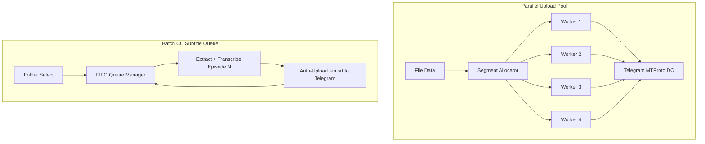

# Teledrive Parallel Upload & Batch CC Queue Implementation Plan

> **For agentic workers:** REQUIRED SUB-SKILL: Use superpowers:subagent-driven-development to implement this plan task-by-task. Steps use checkbox (`- [ ]`) syntax for tracking.

**Goal:** Implement 4-worker parallel MTProto chunk uploading (3x-5x speedup) and 1-click background batch CC subtitle generation queue for full video seasons.

**Architecture:**
1. **Parallel Upload Pool (`parallel_upload.rs`):** Partition large file uploads into non-overlapping 512KB chunk ranges and upload them concurrently using 4 Tokio MTProto workers with adaptive rate limiting.
2. **Batch CC Queue (`batch_cc_queue.rs`):** FIFO queue manager that processes video files sequentially in the background at low process priority, generating and auto-uploading `.en.srt` subtitles for an entire folder.

**Architecture Diagram:**

**Tech Stack:** Rust (Tokio async, Tauri v2), Grammers Client MTProto, SQLite, Actix Web, Whisper.cpp

---

## Global Constraints
- Target Platform: Windows 11 64-bit only
- No unrequested dependencies
- Preserve existing upload retry rules and `FLOOD_WAIT` handling
- Do not commit or push tags without explicit user approval

---

### Task 1: Create Multi-Worker Parallel Upload Module (`parallel_upload.rs`)

**Files:**
- Create: `app/src-tauri/src/parallel_upload.rs`
- Modify: `app/src-tauri/src/lib.rs:50-55`
- Modify: `app/src-tauri/src/commands/fs.rs:1380-1420`

- [ ] **Step 1: Write `parallel_upload.rs` worker pool implementation**
  Create `upload_media_parallel` function with 4 Tokio async tasks downloading/uploading non-overlapping 512KB chunk slices.

- [ ] **Step 2: Connect `parallel_upload.rs` to `cmd_upload_file_inner` in `fs.rs`**
  Dispatch large uploads (>10MB) through `upload_media_parallel`.

- [ ] **Step 3: Test compilation**
  Run: `npx tsc --noEmit --pretty false` in `app/`

---

### Task 2: Create Background Batch CC Subtitle Queue Module (`batch_cc_queue.rs`)

**Files:**
- Create: `app/src-tauri/src/batch_cc_queue.rs`
- Modify: `app/src-tauri/src/lib.rs:55-60`
- Modify: `app/src-tauri/src/commands/english_cc.rs:320-360`

- [ ] **Step 1: Write `batch_cc_queue.rs` FIFO Queue Manager**
  Implement `BatchCcQueueManager` struct with `Arc<Mutex<VecDeque<BatchCcTask>>>`.

- [ ] **Step 2: Add `cmd_batch_generate_english_cc` Tauri command**
  Add command to enqueue all video message IDs in a folder.

- [ ] **Step 3: Test compilation**
  Run: `npx tsc --noEmit --pretty false` in `app/`

---

## Verification Gates
- [ ] `npx tsc --noEmit --pretty false` passes with 0 errors.
- [ ] `git diff --check` passes with 0 formatting warnings.
