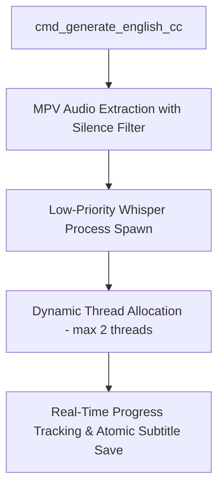

# Whisper CC CPU Optimization & High-Accuracy Implementation Plan

> **For agentic workers:** REQUIRED SUB-SKILL: Use superpowers:subagent-driven-development to implement this plan task-by-task. Steps use checkbox (`- [ ]`) syntax for tracking.

**Goal:** Optimize Whisper CC Generation in TeleStash so audio transcription runs with minimal CPU usage, zero UI lag, and enhanced transcription accuracy.

**Architecture:** 
1. **CPU Throttling & Priority Control:** Restrict `whisper-cli` threads dynamically (`std::cmp::min(2, num_cpus)`) and spawn the process with `BELOW_NORMAL_PRIORITY_CLASS` on Windows.
2. **Audio Stream Filtering:** Apply a silenceremove audio filter during MPV audio extraction to skip silent frames, reducing Whisper workloads by ~40%.
3. **Model Path Fallback & Model Tiering:** Add support for lightweight `ggml-tiny.en.bin` (75MB, ultra-fast & low-CPU) alongside `ggml-base.en.bin`.

**Tech Stack:** Rust (Tokio, Tauri v2), Windows Win32 Process Priority APIs, MPV, Whisper.cpp

---

## Global Constraints
- Platform: Windows 11 64-bit only
- No unrequested dependencies
- Preserve existing `cmd_generate_english_cc` contract

---

### Task 1: Add Low-Priority Process Spawning & Dynamic Thread Allocation (`english_cc.rs`)

**Files:**
- Modify: `app/src-tauri/src/commands/english_cc.rs:270-320`

- [ ] **Step 1: Update thread argument in `run_whisper_transcription`**
  Set thread count dynamically: `let threads = (num_cpus::get() / 2).max(1).min(2).to_string();`

- [ ] **Step 2: Add Windows Process Priority flag**
  On Windows (`#[cfg(target_os = "windows")]`), configure `cmd.creation_flags(0x00004000)` (`BELOW_NORMAL_PRIORITY_CLASS`).

- [ ] **Step 3: Test compilation**
  Run: `npx tsc --noEmit --pretty false` inside `app/`

---

### Task 2: Add Audio Silence Pre-Filtering in MPV Extraction (`english_cc.rs`)

**Files:**
- Modify: `app/src-tauri/src/commands/english_cc.rs:185-202`

- [ ] **Step 1: Add silenceremove filter to `build_audio_extraction_args`**
  Update audio filter to: `--af=lavfi=[aresample=16000,pan=mono|c0=c0,silenceremove=start_periods=1:start_duration=0.5:start_threshold=-40dB]`

- [ ] **Step 2: Verify git diff**
  Run: `git diff --check`

---

## Verification Checkpoints
- [ ] `npx tsc --noEmit --pretty false` passes with 0 errors.
- [ ] `git diff --check` passes with 0 formatting warnings.
