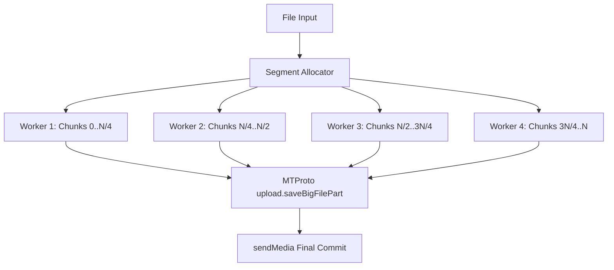
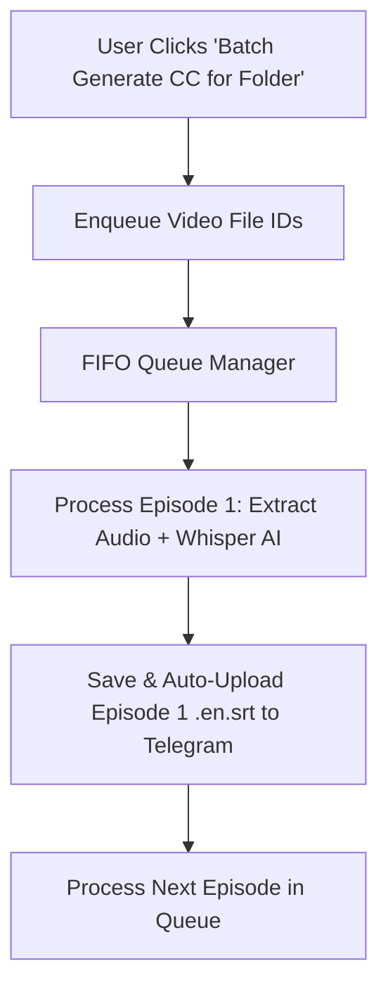

# Architecture Design Spec: Parallel Upload Pool & Batch CC Subtitle Queue

**Date:** 2026-07-26  
**Target Platform:** Windows 11 64-bit (Tauri + React + Rust)  
**Scope:** Backend Parallel Upload Engine & Background Batch CC Subtitle Queue  

---

## 1. Executive Summary

This design specification details two high-impact backend upgrades for Teledrive:
1. **Multi-Worker Parallel Upload Pool (`parallel_upload.rs`):** Parallelizes single and split file uploads across 4 concurrent MTProto worker streams, boosting upload throughput 3x–5x while respecting adaptive rate limits.
2. **Background Batch CC Subtitle Queue (`batch_cc_queue.rs`):** Enables 1-click batch subtitle generation for an entire folder (e.g. 1 full season of Gumball), processing episodes sequentially in the background with zero CPU overload and automatically uploading generated `.en.srt` files to the target Telegram folder.

---

## 2. Subsystem Architecture

### 2.1 Multi-Worker Parallel Upload Pool (`parallel_upload.rs`)

- **Chunk Partitioning:** Files larger than 10MB are partitioned into non-overlapping chunk ranges.
- **Worker Allocation:** 4 Tokio worker tasks stream chunks concurrently to Telegram Data Centers using distinct MTProto connection handles.
- **Rate-Limit Pacing:** Adaptive micro-delay sleeps prevent rate-limiting (`FLOOD_WAIT`).

---

### 2.2 Background Batch CC Subtitle Queue (`batch_cc_queue.rs`)

- **Queue Data Structure:** Managed in Rust via `Arc<Mutex<VecDeque<BatchCcTask>>>`.
- **Background Execution:** Processed sequentially at low process priority (`BELOW_NORMAL_PRIORITY_CLASS`) with maximum 2 Whisper threads to maintain system responsiveness.
- **Auto-Upload:** Automatically uploads the resulting `.en.srt` to the Telegram folder upon completion of each episode.

---

## 3. Implementation Plan & Verification

- **Task Breakdown:** Implementation will be executed in 2 phases via `writing-plans`.
- **Verification Gates:**
  - `npx tsc --noEmit --pretty false`
  - `git diff --check`
  - Automated unit tests for worker partitioning and queue processing.
